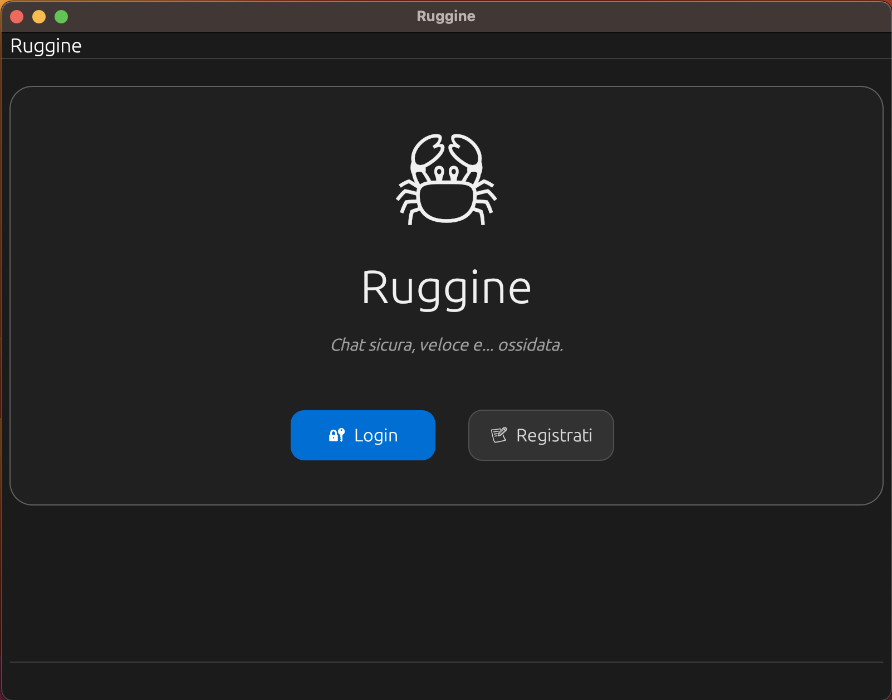
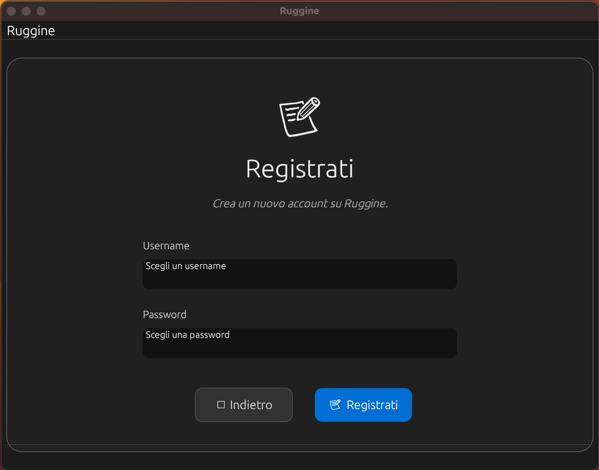
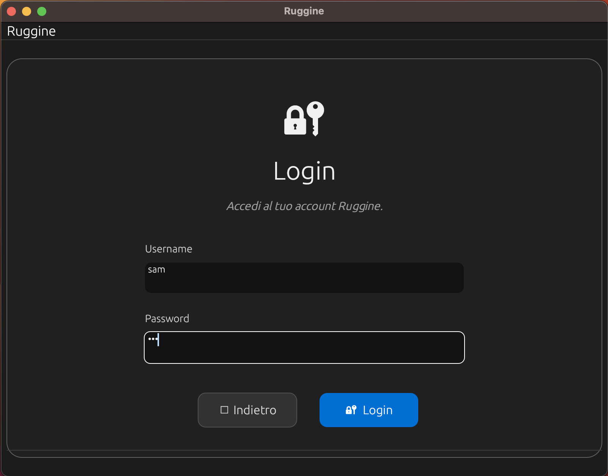
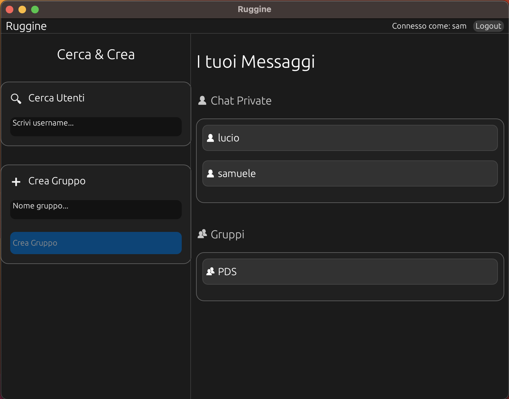
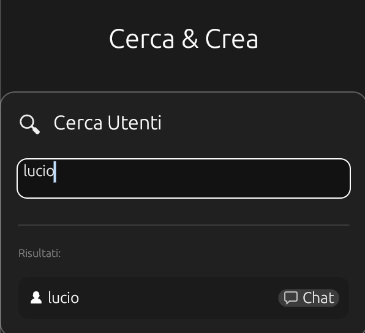
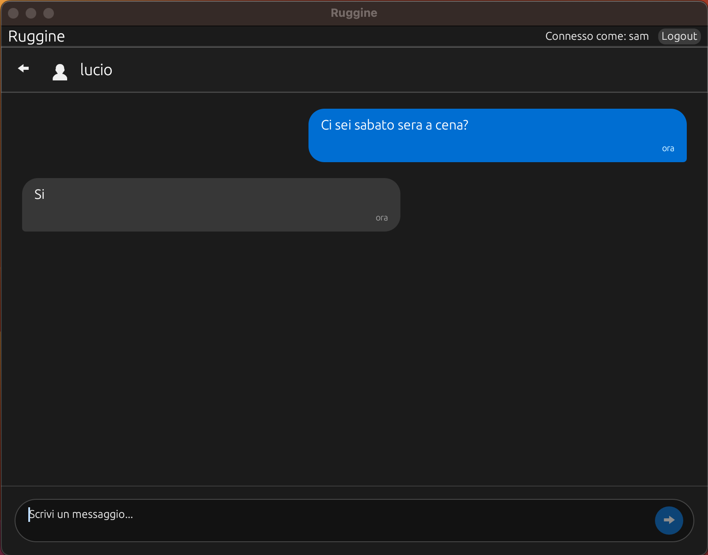
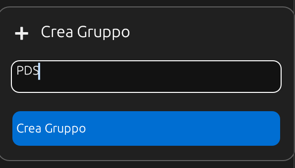
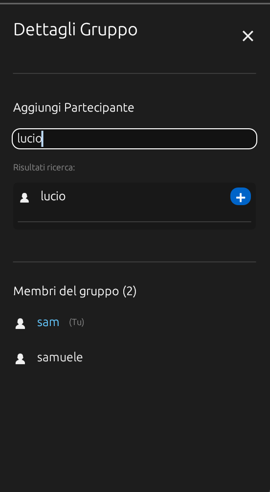
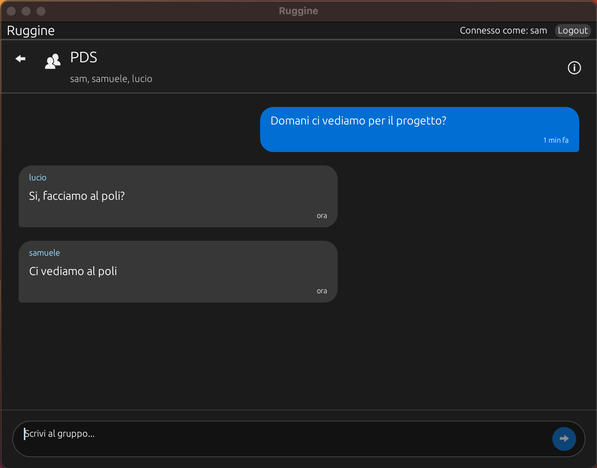

# Manuale Utente - Ruggine 

## Indice

- [Introduzione](#introduzione)
  - [Server](#server)
  - [Client](#client)
- [Avvio applicazione](#avvio-applicazione)
  - [Terminale 1 – Avvio del server](#terminale-1---avvio-del-server)
  - [Terminale 2 – Avvio del client](#terminale-2---avvio-del-client)
- [Client](#client-1)
  - [Registrazione](#registrazione)
  - [Login](#login)
  - [Home page](#home-page)
    - [Ricerca utente e creazione chat privata](#ricerca-utente-e-creazione-chat-privata)
    - [Creazione gruppo e invito](#creazione-gruppo-e-invito)
- [File di log](#file-di-log)
- [Generazione e avvio eseguibili](#generazione-e-avvio-eseguibili)
  - [Generazione eseguibili](#generazione-eseguibili)
  - [Avvio eseguibili](#avvio-eseguibili)


## Introduzione

L’applicazione **Ruggine** è una piattaforma di messaggistica **client–server** realizzata in **Rust**, 
progettata per supportare chat private, chat di gruppo e notifiche push in tempo reale.

È composta da **due componenti distinti**, ognuno con responsabilità precise e collegate tra loro 
tramite un protocollo basato su messaggi JSON incapsulati in frame con **LengthDelimitedCodec**.

---

### Server

Il server è un'applicazione **a riga di comando** basata su **Tokio** e progettata per gestire:

- **Connessioni TCP** (porta 7878)
- **Registrazione e autenticazione degli utenti**
- **Chat private e gruppi**
- **Invio di notifiche push** tramite `PeerMap`
- **Persistenza dati** tramite `SqliteStorage`

### Client

Il client è un’applicazione desktop con **interfaccia grafica (GUI)** sviluppata usando **egui** tramite `eframe`.

Consente all’utente di:

- Registrarsi e autenticarsi tramite il server
- Visualizzare chat private e di gruppo
- Inviare e ricevere messaggi
- Ricevere notifiche push tramite una task asincrona
- Interagire con la logica di backend tramite un wrapper di rete (`net.rs` lato client)

La comunicazione tra client e server è asincrona, strutturata e robusta grazie a Tokio, 
ai codec framed, a SQLite e alla gestione attenta delle sessioni tramite `PeerMap`.

## Avvio applicazione 

L'applicazione necessita l'utilizzo di almeno due terminali per un corretto funzionamento.

### Terminale 1 - Avvio del server 

- Terminale aperto nella cartella dell'applicazione
- Digitare il comando:
    ```bash
    cargo run -p server
    ```

### Terminale 2 - Avvio del client 

- Terminale aperto nella cartella dell'applicazione
- Digitare il comando:
    ```bash
    cargo run -p client
    ```
- Ogni client necessita di un terminale distinto per l'avvio

## Client 
All'avvio dell'applicazione, viene mostrata la pagina di accesso dell'applicazione,
con le due opzioni:
- `Login`
- `Registrati`



### Registrazione 
A partire dalla schermata di accesso, cliccando sul pulsante 'Registrati', si viene indirizzati 
alla pagina di registrazione, dove devono essere compilati i seguenti campi:
- ***username*** univoco 
- ***password*** a scelta

I risultati di questa operazione sono due:
- **Registrazione avvenuta con successo:** viene nuovamente mostrata la pagina di accesso, dove verrà chiesto di eseguire il login 
- **Errore:** viene riportato un messaggio di errore (es. 'Input vuoti', 'Username già in uso' etc)



### Login 
Cliccando sul pulsante 'Registrati', si viene indirizzati alla pagina di registrazione dove
devono essere compilati i seguenti campi:
- ***username***
- ***password*** 

I risultati di questa operazione sono due:
- **Login avvenuto con successo:** viene mostrata la 'home page' dell'applicazione
- **Errore:** viene riportato un messaggio di errore (es. 'Credenziali errate' etc)



### Home page
Nella home page sono visualizzate le seguenti schermate:
- **Logout**: bottone in alto a destra per eseguire il logout dall'applicazione
- **Cerca utenti**: dove inserire l'username da cercare per poter creare una chat privata
- **Chat private**: lista delle chat private attive
- **Crea gruppo**: dove inserire il nome del gruppo e procedere alla creazione
- **Gruppi**: lista dei gruppi in cui l'utente loggato è presente



#### Ricerca utente e creazione chat privata
A partire dalla home page:
- Nel box **Cerca utenti**, digitare l'username col quale creare la chat
- Durante la ricerca, appariranno gli username sotto forma di lista
- Sulla destra dell'utente nella lista, sarà presente un icona 'messaggio'
- Una volta cliccato l'icona, l'utente sarà visualizzato nella lista delle chat private
- Cliccando sull'utente presente nella lista delle chat private, verrà visualizzata la schermata della chat
- Da questa schermata si può:
  - tornare alla home page
  - scrivere un messaggio e inviarlo premendo 'Enter' o l'icona apposita d'invio 




#### Creazione gruppo e invito 
A partire dalla home page:
- Nel box **Crea gruppo** inserire il nome del gruppo 
- Cliccare il bottone 'Crea gruppo'
- Il nome del gruppo apparirà nella lista 'Gruppi' presente nella home page
- Cliccando sul nome dalla lista, verrà visualizzata la chat di gruppo
- Da questa schermata si può:
    - tornare alla home page
    - cliccare sul bottone 'info' per:
        - visualizzare i membri del gruppo 
        - invitare membri mediante la ricerca dell'username (l'utente verrà aggiunto in automatico e visualizzerà il nome del gruppo nella sua home page sotto la voce **Gruppi**)
    - scrivere messaggi e inviarli premendo 'Enter' o l'icona apposita d'invio





## File di log 

Durante l'esecuzione del server, ogni 120 secondi, la routine di monitoring aggiunge una riga di log all'interno di **server_cpu_log.txt**.
In ogni riga è presente il timestamp e la percentuale di utilizzo della CPU, es:
`[2025-11-25 12:06:28] CPU Usage: 0.94%`

## Generazione e avvio eseguibili

### Generazione eseguibili

Con il terminale aperto nella cartella principale del progetto, eseguire i seguenti comandi:
    ```bash
    cargo build -p server --release
    cargo build -p client --release
    ```

Terminata la compilazione, gli eseguibili saranno disponibili nei path seguenti:
    - `target/release/server`
    - `target/release/client`

### Avvio eseguibili 

Con il terminale aperto nella cartella principale del progetto, eseguire i seguenti comandi:
    ```bash
    cargo run -p server --release
    cargo run -p client --release
    ```

